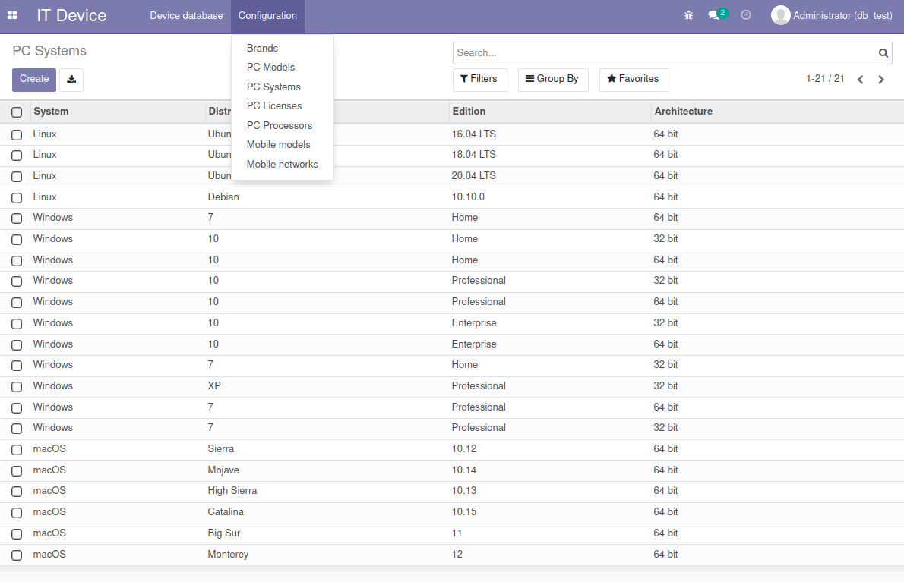
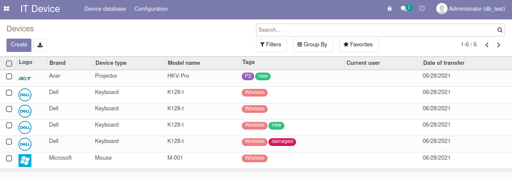
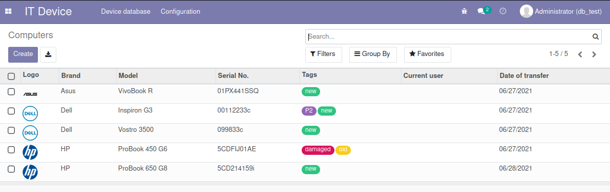
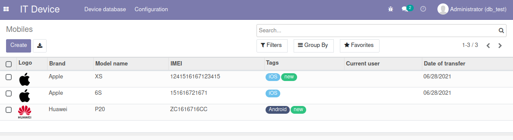
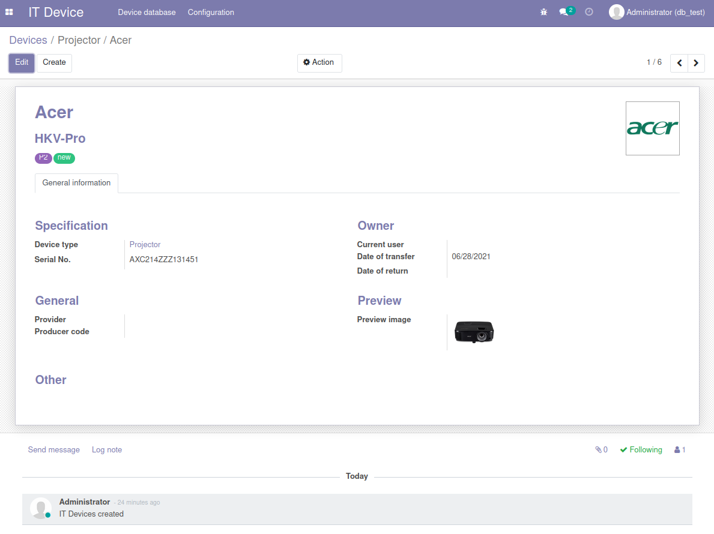
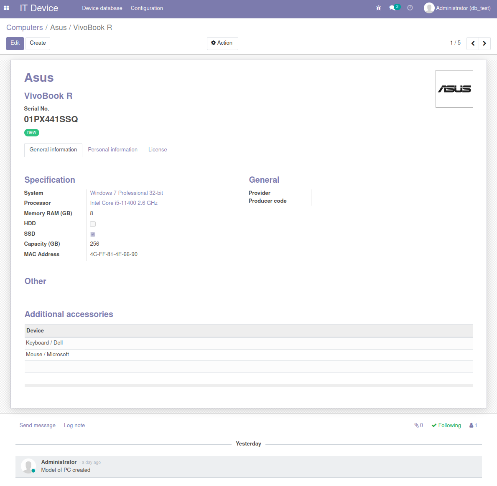
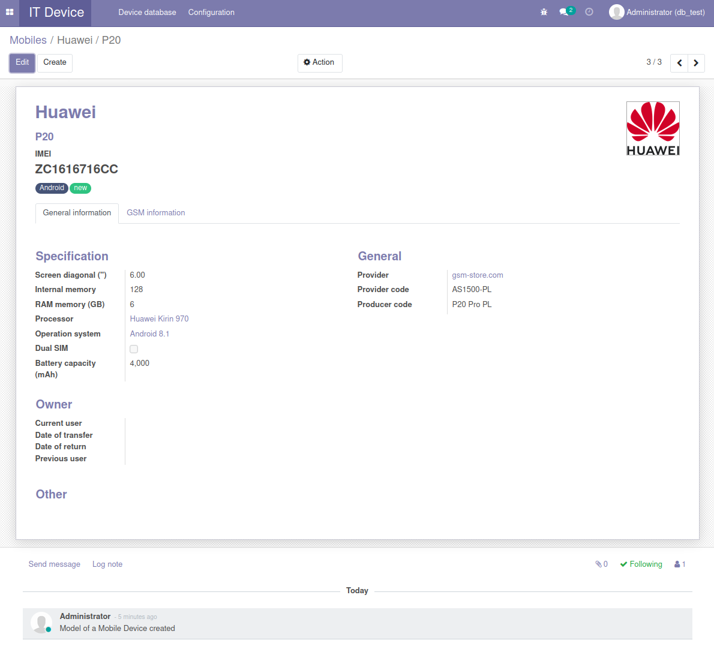

# IT Device & IT Service Management Odoo Modules

This repository contains two custom Odoo modules:

- **it_device**: Device inventory and management (PCs, mobiles, etc.)
- **it_service_management**: IT support ticketing system with device integration

---

## Features

### it_device

- Manage all IT devices: PCs, smartphones, and generic devices
- Assign devices to employees
- Track device details (serial, IMEI, specs, etc.)
- Device history and transfer management

### it_service_management

- Create and manage IT service tickets
- Link tickets to clients and devices (PC, mobile, or generic)
- Assign tickets to IT technicians
- Track ticket status, priority, and deadlines
- Print tickets as PDF with a modern, styled layout

---

## Installation

1. **Clone or download this repository** into your Odoo `custom_addons` directory:

    ```sh
    git clone https://github.com/medaminerizki/odoo_it_modules.git C:/Program Files/Odoo 17.0.20250609/custom_addons/
    ```

2. **Dependencies**  
   - Odoo 17.0+
   - The `it_device` module must be installed before `it_service_management`
   - Standard Odoo modules: `base`, `contacts`, `hr`

3. **Update the App List** in Odoo.

4. **Install `it_device` first**, then `it_service_management` from the Odoo Apps menu.

---

## Usage

### Device Management

- Go to **IT Device** menu to add/manage PCs, mobiles, and other devices.
- Assign devices to employees via the device form or employee form.

### IT Service Tickets

- Go to **IT Service Management** menu.
- Create a new ticket, select a client, and choose a device (PC, mobile, or other).
- Assign the ticket to a technician.
- Track ticket progress through various states (New, In Progress, Waiting Info, Solved, Closed).
- Use the **Imprimer PDF** button to generate a styled PDF of the ticket.

---

## PDF Report

- The ticket PDF is generated using a modern, colored QWeb template.
- Device details (serial, IMEI, etc.) are shown according to device type.

---

## Development & Contribution

- Fork the repository and submit pull requests for improvements or bug fixes.
- Ensure your code follows Odoo best practices.

---

## License

This project is licensed under the Odoo Proprietary License v1.0 or as specified in each module.

---

## Author

- Mohamed Amine RIZKI

---

## Screenshots

## Screenshots

### Device Management

- **Configuration**
  

- **Device List**
  

- **PC Devices List**
  

- **Mobile Devices List**
  

- **Device Details View**
  

- **PC Details View**
  

- **Mobile Details View**
  

- **IT Tickets List**
  


---

## Support

For issues or feature requests, please use the GitHub Issues page.
